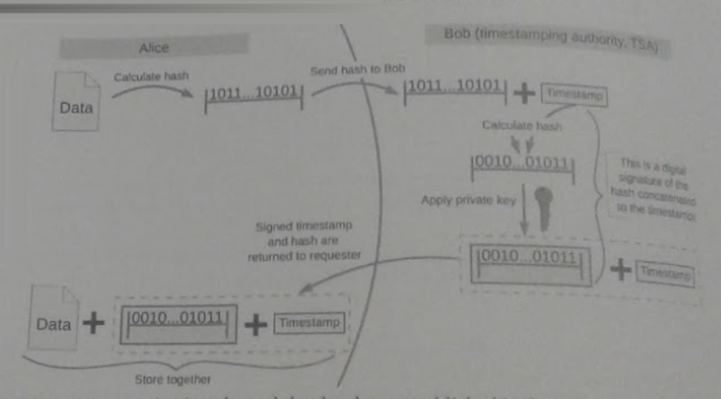
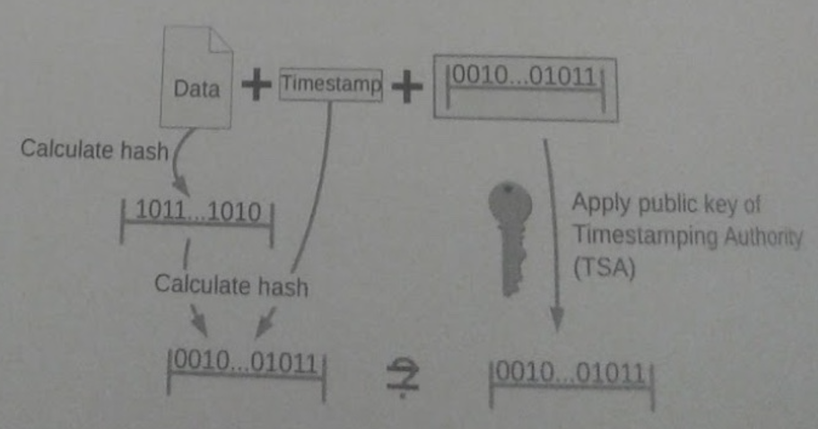

# isp-midterm-exercise
Exercise for information security and privacy class midterm about cryptography

## Instructions:

We have an insecure communication channel between Alice and Bob. They both use 2048-bit RSA public-private key pairs
(their longs-term keys), and their public keys are known to both of them: Alice knows Bob's and Bob knows Alice's.

#### Assignment 1 (15% or 25%)

Implement a key-agreement protocol between Alice and Bob. Implement either option A or option B.
(You may skip this part and just assume they have a shared secret, but no points will be added)

- Option A (15%) Implement a key-agreement protocol in which Alice and Bob agree upon a shared secret.
- Option B (25%) Implement a forward-secure key-agreement protocol in which Alice and Bob agree upon a shared secret.

A forward-secure protocol is one that protects the confidentiality of data in cases where the attacker records all
message exchanges and then (at some point in the future), recovers the long-term keys (...). You may find
additional hints in the following Wikipedia entry https://en.wikipedia.ory/wiki/korward_secrecy/Example.

Note. Since you are implementing forward-secrecy only for the key-agreement protocol, you do not need to
recreate the session (AES) key for every message exchange: once Alice and Bob agree upon a shared secret, the
same secret (key) can be used for all message exchanges in this assignment.

#### Assignment 2 (20%)

Use the agreed-upon secret to secure the communication channel.

#### Assignment 3 (35%)

Once the channel has been secured, make Bob act as a trusted time stamping authority, this is as an entity that
guarantees that a document existed at some point in time. The time stamping protocol works as follows:

- Alice creates a message and computes a digest from it. She sends the digest to Bob.
- Bob receives the digest, obtains the current time stamp and appends the time stamp to the digest. 
For the time stamp, use Unix time, and encode it as a byte array, not as a string: 
you need 8 bytes to represent a number of type long in Java: `long timestamp = System.currentTimeMillis;`
- Bob signs the original digest and the concatenated time stamp with his private key.
- Bob returns the signature and the time stamp to Alice.

All data exchanges have to occur over secure communication channel that has been established in the previous step.

#### Assignment 4 (20%)

When Alice receives the message, she reads (and prints) the time stamp and verifies the signature. 
The verification protocol is given on the image below.

